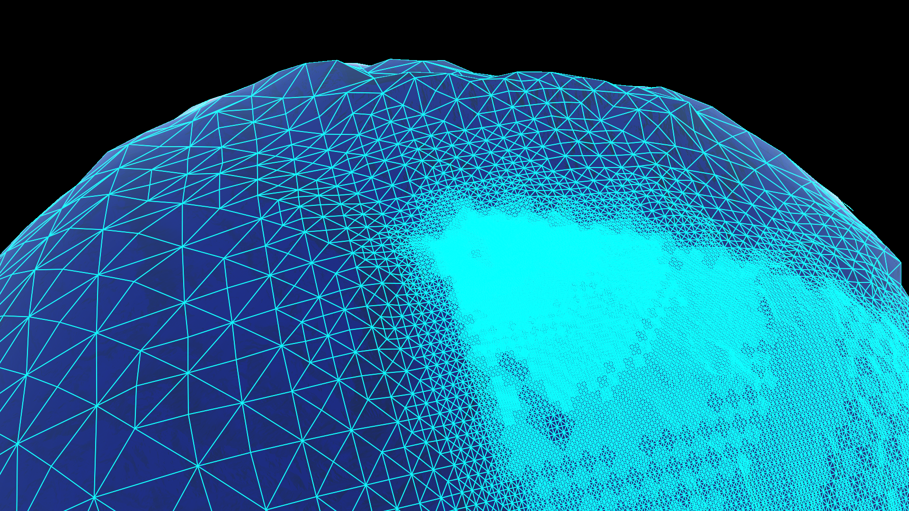

# Terrain

The Alire crate orka\_plugins\_terrain provides packages to render
adaptively tessellated terrain of a planet on the GPU.

- Updates and renders multiple terrain tiles and uses heuristics to
determine on the CPU which tiles need to be updated and rendered.

- Supports flattened spheroids with warping to reduce RMSE when
projecting cubes on spheres.

- Can optionally display a wireframe on top of the rendered terrain.

!!! info
    The various objects described on this page are declared in
    the package `:::ada Orka.Features.Terrain` and its child packages.

## Creating terrain

To render the terrain, first create some location objects containing
the shaders of the crate:

```ada
Location_Data : constant Locations.Location_Ptr :=
  Locations.Directories.Create_Location ("data");

Location_Terrain : constant Locations.Location_Ptr :=
  Locations.Directories.Create_Location ("path/to/orka_plugin_terrain/data/shaders");
```

`Location_Data` should point to a location containing the `terrain/` directory,
which should contain the height texture.

- The height map is `RG16` (2x `Unsigned_16`) (about 86 MiB) or
  `COMPRESSED_RG_RGTC2` (about 17 MiB).

### Configuration

To adaptively tesselate terrain, some parameters are needed which specify
how much the terrain should be tesselated:

```ada
Terrain_Parameters : Subdivision_Parameters :=
  (Meshlet_Subdivision  => 3,
   Edge_Length_Target   => 16,
   Min_LoD_Standard_Dev => 0.00);

Terrain_Min_Depth : constant := 6;
Terrain_Max_Depth : constant := 20;

Displace_Terrain : constant Boolean := False;
```

The maximum tesselation is controlled by the constant `Terrain_Max_Depth`.
Increase this constant to further subdivide the terrain.
However, older GPUs might not be able to handle values greater than 20.

!!! warning "A maximum depth of 20 might be too low"
    Intel GPUs cannot handle very large max terrain subdivision levels,
    which limits the maximum terrain resolution.
    Currently the maximum `Terrain_Max_Depth` is set to 20.
    Discrete GPUs might handle larger values.
    A value of 20 gives a resolution of about 2 km per triangle.
    A way needs to be found to also render terrain with a higher resolution
    when the camera is close to the surface.
    Either replace the (up to) 5 tiles with 1 to 3 smaller tiles (3 when
    viewing a corner of the Earth cube) or have 1 extra very small tile that
    is always somewhat in the center of the screen (between the camera and
    the center of the Earth).

### Creating helpers

Create `Terrain` and `Terrain_Planet` objects by calling the functions
`Create_Terrain` and `Create_Terrain_Planet`:

```ada
Terrain_1_Planet : Terrain_Planet :=
  Create_Terrain_Planet
    (Earth_Data, Planets.Earth.Planet,
     Cached_Atmosphere, Location_Data, Location_Terrain);

procedure Initialize_Atmosphere_Terrain_Program
  (Program : Orka.Rendering.Programs.Program) is
begin
   Program.Uniform_Sampler ("u_DmapSampler").Verify_Compatibility
     (Terrain_1_Planet.Height_Map);
end Initialize_Atmosphere_Terrain_Program;

Terrain_1 : Terrain := Create_Terrain
  (Count             => 6,
   Min_Depth         => Terrain_Min_Depth,
   Max_Depth         => Terrain_Max_Depth,
   Scale             => (if Displace_Terrain then 1.0 else 0.0),
   Wireframe         => True,
   Location          => Location_Terrain,
   Render_Modules    => Terrain_1_Planet.Render_Modules,
   Initialize_Render => Initialize_Atmosphere_Terrain_Program'Access);
```

## Rendering

Create two timers:

```ada
Timer_Terrain_Update : Orka.Timers.Timer := Orka.Timers.Create_Timer;
Timer_Terrain_Render : Orka.Timers.Timer := Orka.Timers.Create_Timer;
```

Some variables can be defined to control whether the wireframe must
be shown and whether the terrain must be updated when the camera changes
its position:

```ada
Freeze_Terrain_Update  : Boolean := False;
Show_Terrain_Wireframe : Boolean := True;
```

Finally, render the terrain with procedure `Render`:

```ada
declare
   Visible_Tiles : Natural := 0;
begin
   Terrain_1_Planet.Render
     (Terrain       => Terrain_1,
      Parameters    => Terrain_Parameters,
      Visible_Tiles => Visible_Tiles,
      Camera        => Camera,
      Planet        => Planet,
      Star          => Sun,
      Rotation      => Orientation_Planet,
      Center        => Translation_Planet,
      Freeze        => Freeze_Terrain_Update,
      Wires         => Show_Terrain_Wireframe,
      Timer_Update  => Timer_Terrain_Update,
      Timer_Render  => Timer_Terrain_Render);
end;
```

In the variable `Visible_Tiles` the number of tiles which are visible will be stored.

The `Camera` needs to be a `Camera_Ptr` (defined in package `:::ada Orka.Cameras`)
and `Planet` and `Sun` need to be pointers to two objects implementing
the interface `Behavior` (defined in package `:::ada Orka.Behaviors`).

`Orientation_Planet` should be a `Matrix4` describing the desired rotation
of the planet.
`Translation_Planet` should be a `Matrix4` describing the translation
from the camera's view position to the center of the planet, divided
by `Earth_Data.Length_Unit_In_Meters`:

```ada
T ((Planet.Position - Camera.View_Position) * (1.0 / Earth_Data.Length_Unit_In_Meters)`
```

See [Transformations](/transforms/matrices/#transformations) for more information.

The directory `terrain/` in the location `Location_Data` should contain
the file `terrain-render-atmosphere.frag`. This fragment shaders should
implement the function `:::glsl vec4 ShadeFragment(vec2 texCoord, vec4 worldPos)`.

!!! bug "Unexpected amount of subdivision"
    The terrain code originally worked only on a single flat tile, without any
    problems. To render a planet, 6 tiles are needed (of which only 2 to 5 can
    be visible). These tiles are also curved and then warped to reduce the RMSE
    when projecting cubes on spheres.
    When you zoom out and view the planet at a distance, some parts of each
    tile like the center or corners get less or more subdivisions than you
    would expect based on the distance from the camera to the surface. This
    problems shows up more clearly when you change `Meshlet_Subdivision` to 1.

!!! bug "Frustum and occlusion culling is partly broken"
    Frustum and occlusion culling (in `data/shaders/terrain/terrain-update-lod.comp`)
    might need to be fixed when terrain is displaced.

!!! bug "All tiles use a single height and slope map"
    All tiles currently use a texture in `data/terrain/terrain-dmap.ktx`,
    accessed through the location object `Location_Data`.
    To get the actual terrain of the Earth rendered, NASA SRTM DEM data is
    needed, converted to an `Unsigned_16_Array` (for the height map),
    and then written to a .ktx texture.
    See `data/shaders/terrain/terrain-render-sphere.glsl` for how a point on a
    plane or tile is changed to a point on a sphere.

### Screenshots

Triangle culling of terrain is based on the frustum and the distance from camera:



Increase the minimum level of detail (LoD) variance to reduce the number
of triangles on flat terrain:


