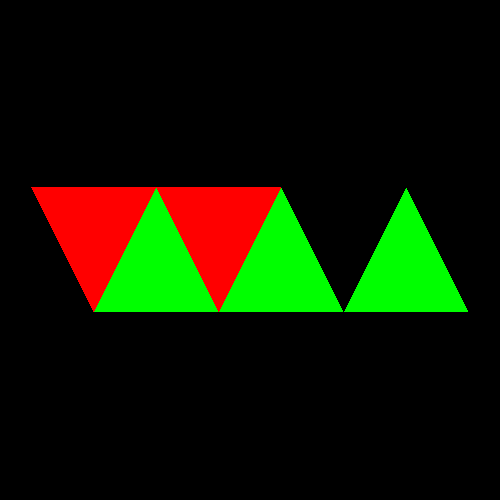
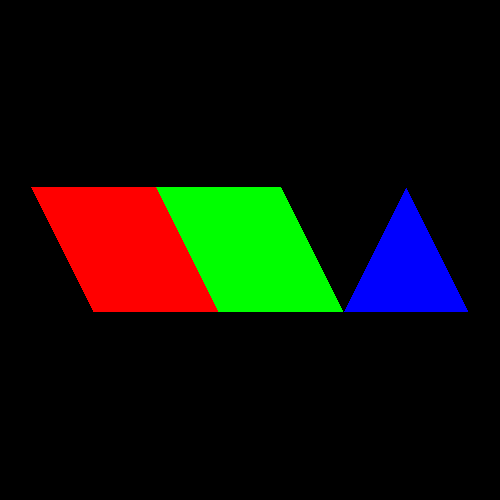

# Drawing geometry

The package `:::ada Orka.Rendering.Drawing` provides several procedures
to draw geometry to the currently used framebuffer.
There are several ways to draw geometry:

- Vertices can be drawn with or without indices
- Vertices can be drawn directly or indirectly

For each of the possible combinations are different procedure is used:

|                 | Direct         | Indirect                |
+-----------------+----------------+-------------------------+
| Without indices | `Draw`         | `Draw_Indirect`         |
| With indices    | `Draw_Indexed` | `Draw_Indexed_Indirect` |

Because Orka supports only [programmable vertex pulling](/rendering/vertex-formats/),
the buffer containing the vertices must be binded as an SSBO to a
binding point before it can be drawn using one of the procedures
mentioned above. See [Binding vertex data](/rendering/vertex-formats/#binding-vertex-data)
for more information on how to bind a buffer.

For example, one triangle consisting of three vertices can be drawn using:

```ada
Orka.Rendering.Drawing.Draw (GL.Types.Triangles, 0, 3);
```

The optional parameter `Instances` can be specified to draw multiple instances.

In the vertex shader, `:::glsl gl_VertexID` can be used to get the vertex ID.

## Indices

Since vertices in geometry are often used by multiple primitives (triangles or lines),
it is recommended to use indices to avoid having to repeat the data
for a vertex multiple times in the vertex buffer.
The indices are used to refer to vertices (the data of a vertex includes
information like the position, normal, and texture coordinates).
These indices are stored in a vertex buffer.
This buffer is automatically binded by one of the above procedures.

Procedure `Draw_Indexed` is used to draw geometry with an index buffer.
For example, 10 instances of the geometry (consisting of triangles)
can be drawn using:

```ada
Orka.Rendering.Drawing.Draw_Indexed
  (Triangles, Buffer_Indices, 0, Buffer_Indices.Length, Instances => 10);
```

## Indirect drawing

Indirect drawing is useful if the draw calls are generated by a compute
shader on the GPU.
Inserting a barrier and then a single call to `Draw_Indexed_Indirect` is
sufficient to draw instances of multiple objects.
When performing frustum and occlusion culling on the GPU, millions of objects
can be rendered without much work done on the CPU itself.

When drawing indirectly, the actual draw calls are stored in a buffer
containing elements of the type `Arrays_Indirect_Command` or `Elements_Indirect_Command`,
defined in the package `:::ada GL.Types.Indirect`.

Generally, it is recommended to use the procedure `Draw_Indexed_Indirect`
so that an index buffer is used.
The procedure `Draw_Indexed_Indirect` requires a parameter `Index_Buffer`
for the index buffer, and a `Buffer` containing the draw commands.

Two other instances of the procedure exist: one with an `Offset` and `Count`,
both of type `Natural`, and another with just `Count` being another buffer.
The `Count` buffer contains the number of draw commands that must be rendered.
It is useful if this buffer is written to by a compute shader on the GPU.
Without this extra buffer, the procedure `Draw_Indexed_Indirect` uses the
length of the buffer containing the commands (`Buffer.Length`).

Indirect drawing can be quite complicated.
The package `:::ada Orka.Rendering.Buffers.MDI` can be used to create
the necessary vertex, index, and command buffers.

### Example

As an example, three instances of an object, consisting of two parts
can be rendered to the screen. In this example, each part is just one triangle;
one pointing downwards and one pointing upwards.

The vertices and indices are declared as following:

```ada
Vertices_1 : constant Orka.Float_32_Array
  := (-0.25,  0.5,
      -0.75, -0.5,
       0.25, -0.5);

Vertices_2 : constant Orka.Float_32_Array
  := (-0.25,  0.5,
       0.25, -0.5,
       0.75,  0.5);

Indices_1 : constant Orka.Unsigned_32_Array := (0, 1, 2);
Indices_2 : constant Orka.Unsigned_32_Array := (0, 1, 2);
```

Then create a `Batch` object:

```ada
Batch_1 : Batch := Create_Batch
  (Orka.Types.Single_Type, Orka.Types.UInt_Type, 2,
   Vertices_1'Length + Vertices_2'Length,
   Indices_1'Length + Indices_2'Length);
```

After the `Batch` object has been created, vertices and indices can be
written to its buffers:

```ada
procedure Append_Draw_Call
  (Instances : Natural; Vertices : Orka.Float_32_Array; Indices : Orka.Unsigned_32_Array)
is
   Vertex_Elements : constant := 2;

   procedure Append_Vertices (Offset, Count : Natural) is
   begin
      Batch_1.Data.Write_Data (Vertices, Offset => Offset * Vertex_Elements);
   end Append_Vertices;

   procedure Append_Indices (Offset, Count : Natural) is
   begin
      Batch_1.Indices.Write_Data (Indices, Offset => Offset);
   end Append_Indices;
begin
   Batch_1.Append (Instances, Vertices'Length / Vertex_Elements, Indices'Length,
     Append_Vertices'Access, Append_Indices'Access);
end Append_Draw_Call;
```

Two instances of the first object (a triangle pointing downward) are added,
and three instances of the second object:

```ada
Append_Draw_Call (2, Vertices_1, Indices_1);
Append_Draw_Call (3, Vertices_2, Indices_2);
Batch_1.Finish_Batch;
```

#### Rendering

The instances can then be rendered by binding the vertex buffer and then
calling `Draw_Indexed_Indirect`:

```ada
Batch_1.Data.Bind (Shader_Storage, 0);

Orka.Rendering.Drawing.Draw_Indexed_Indirect
  (Mode         => GL.Types.Triangles,
   Index_Buffer => Batch_1.Indices.Buffer,
   Buffer       => Batch_1.Commands.Buffer);
```

In the vertex shader, `:::glsl gl_VertexID` and `:::glsl gl_InstanceID`
should be used to write a position to `:::glsl gl_Position`.

In the fragment shader, the parts and instances can be drawn using the:

- Draw ID with `:::glsl gl_DrawIDARB`
- Instance ID with `:::glsl gl_InstanceID`
- Object ID with `:::glsl gl_BaseInstanceARB + gl_InstanceID`

`:::glsl gl_DrawIDARB` and `:::glsl gl_BaseInstanceARB` require the extension
`ARB_shader_draw_parameters`:

```glsl
#extension GL_ARB_shader_draw_parameters : require
```

Creating an array of the colors red, green, blue, yellow, magenta, cyan, or white
in the fragment shader, then choosing a color in one of the three ways
mentioned above, the following results are obtained.

Draw ID:



Instance ID:



Object ID:


